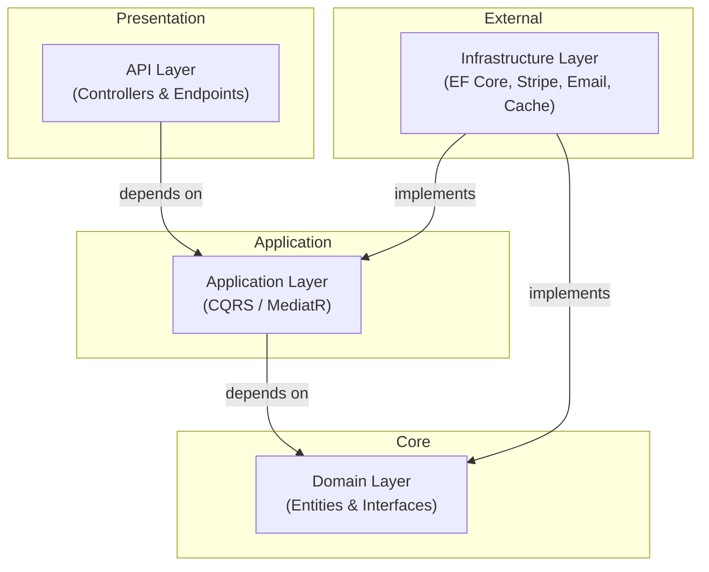
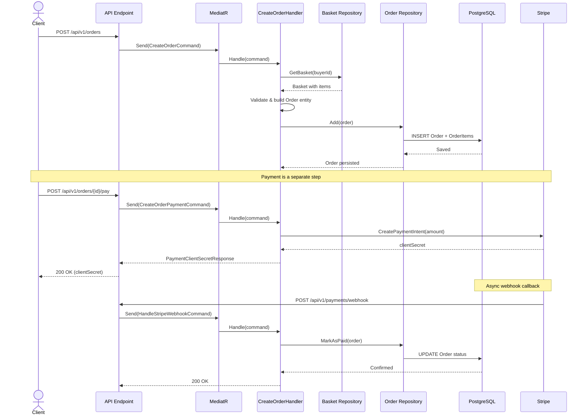
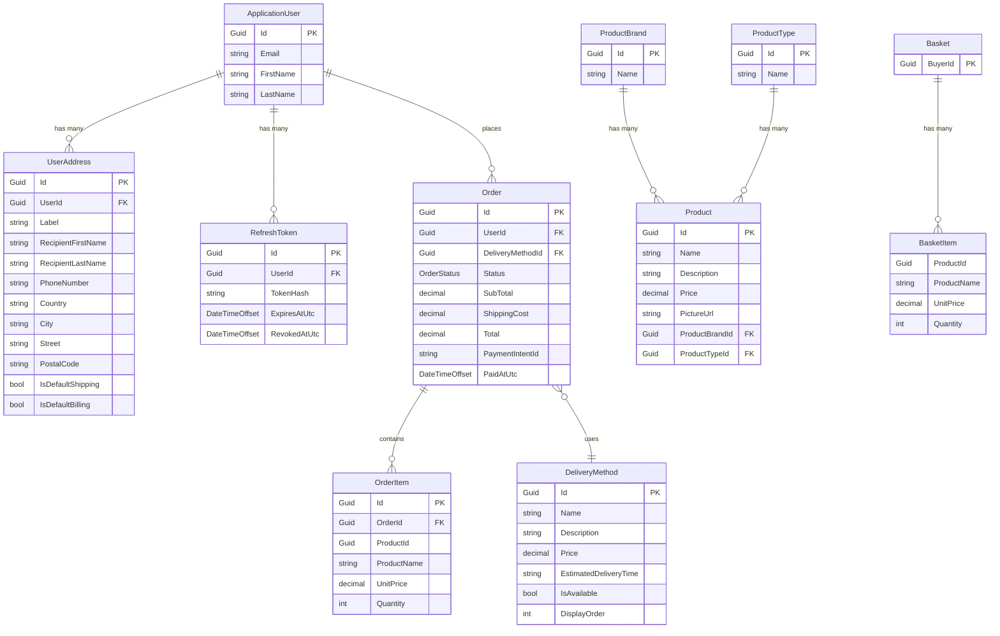

# ECommerce Clean Architecture API


A modern, production-grade RESTful API built with ASP.NET Core 10, following Clean Architecture principles and CQRS patterns to provide a scalable and maintainable e-commerce backend.

---

## Features

- **Clean Architecture & CQRS:** Highly decoupled architecture utilizing MediatR.
- **Robust Authentication & Authorization:** ASP.NET Core Identity with JWT Bearer authentication, refresh tokens, and email verification.
- **Product Management:** Full support for products, brands, and product types.
- **Shopping Basket:** High-performance distributed basket management utilizing .NET HybridCache.
- **Order Processing:** Order creation, tracking, and delivery method selection.
- **Secure Payments:** Integrated with Stripe for secure checkout processing.
- **API Versioning & Documentation:** Versioned API endpoints documented interactively via Swagger UI.
- **Structured Logging:** Centralized logging with Serilog.
- **Data Persistence:** Entity Framework Core with PostgreSQL.
- **Robust Error Handling:** Global exception handling and RFC-compliant Problem Details responses.
- **Design Patterns Used:** Repository Pattern, Unit of Work, Result Pattern, and Specifications Pattern.

---

## Architecture

The solution implements **Clean Architecture** to ensure separation of concerns, testability, and maintainability.

| Layer | Responsibility |
|---|---|
| **Domain** | Core business logic, entities, value objects, exceptions, and interfaces. Uses the Result Pattern for predictable error flows. |
| **Application** | Business use cases implemented via CQRS (Commands & Queries) using MediatR. Depends only on Domain. |
| **Infrastructure** | Data access, external services (Stripe, Email), caching. Contains EF Core DbContexts, Repositories, and Identity implementation. |
| **API (Presentation)** | ASP.NET Core web application with Controllers, Minimal API Endpoints, Middleware, API Versioning, and Swagger. |

### Architecture Diagram



> **Dependency Rule:** Dependencies always point **inward**. The Domain layer has zero external dependencies. Infrastructure implements abstractions defined in Application and Domain — never the reverse.

---

## Request Flow

The following sequence diagram illustrates a real **Create Order** flow through the system:



---

## Database Schema



---

## Technologies

| Category | Technology |
|---|---|
| **Framework** | .NET 10.0 / ASP.NET Core |
| **Database** | PostgreSQL |
| **ORM** | Entity Framework Core |
| **Authentication** | ASP.NET Core Identity, JWT (JSON Web Tokens) |
| **Payment Gateway** | Stripe |
| **Caching** | .NET HybridCache |
| **Logging** | Serilog |
| **API Documentation** | Swashbuckle (Swagger) |
| **Email Delivery** | FluentEmail (SMTP) |
| **Architecture Patterns** | Clean Architecture, CQRS, Repository, Unit of Work, Specification Pattern |

---

## Project Structure

```
ECommerce/
├── Src/
│   ├── ECommerce.Domain/          # Core entities, value objects, errors, interfaces
│   ├── ECommerce.Application/     # CQRS Handlers, Validation, Use Cases
│   ├── ECommerce.Infrastructure/  # DbContext, Migrations, Stripe, Identity, Email, Seeders
│   └── ECommerce.API/             # Controllers, Endpoints, Middleware, Program.cs
├── Directory.Packages.props       # Central NuGet package management
├── ECommerce.slnx                 # Solution file
└── README.md
```

---

## Getting Started

### Prerequisites

- [.NET 10.0 SDK](https://dotnet.microsoft.com/)
- [PostgreSQL](https://www.postgresql.org/)
- A Stripe Account (for payment processing)

### Installation

Clone the repository and navigate to the API project folder:

```bash
git clone <repository-url>
cd ECommerce/Src/ECommerce.API
```

### Database Setup

Ensure PostgreSQL is running. The default connection string is specified in `appsettings.json`, but you should configure it locally if your credentials differ.

### User Secrets Configuration

To keep sensitive data secure, do not put real passwords or API keys in `appsettings.json`. Use the `dotnet user-secrets` tool:

```bash
dotnet user-secrets init

# Set the Database Connection (Optional if using defaults)
dotnet user-secrets set "ConnectionStrings:DefaultConnection" "Host=localhost;Database=ecommerce_db;Username=postgres;Password=your_password"

# Set JWT Secret (Must be at least 32 characters)
dotnet user-secrets set "Jwt:Secret" "Your_Super_Secret_Key_At_Least_32_Chars!"

# Set Email Credentials for SMTP (e.g., Mailtrap or SendGrid)
dotnet user-secrets set "Email:Username" "your_smtp_username"
dotnet user-secrets set "Email:Password" "your_smtp_password"

# Set Super Admin Seed Password
dotnet user-secrets set "Seed:SuperAdmin:Password" "SecureAdminPassword123!"

# Set Stripe Keys
dotnet user-secrets set "Stripe:PublishableKey" "pk_test_..."
dotnet user-secrets set "Stripe:SecretKey" "sk_test_..."
dotnet user-secrets set "Stripe:WebhookSecret" "whsec_..."
```

### Running Migrations

To apply the Entity Framework Core migrations to your PostgreSQL database:

```bash
dotnet ef database update --project ../ECommerce.Infrastructure --startup-project .
```

> **Note:** Running the application in Development mode will automatically apply migrations and seed the database.

### Running the application

```bash
dotnet run
```

The API will start at `https://localhost:7238` (or the port specified in `launchSettings.json`).

---

## API Endpoints Overview

All endpoints are versioned under `/api/v1/`. The API uses both **Controllers** and **Minimal API Endpoints**.

### Authentication

| Method | Endpoint | Description |
|---|---|---|
| `POST` | `/api/v1/auth/register` | Register a new user (sends email verification code) |
| `POST` | `/api/v1/auth/confirm-email` | Confirm email with verification code |
| `POST` | `/api/v1/auth/login` | Login and receive access + refresh tokens |
| `POST` | `/api/v1/auth/refresh` | Exchange refresh token for new token pair |
| `POST` | `/api/v1/auth/logout` | Revoke a refresh token |

### Users

| Method | Endpoint | Description |
|---|---|---|
| `GET` | `/api/v1/users/me` | Get current user profile |
| `PUT` | `/api/v1/users/me` | Update current user profile |
| `GET` | `/api/v1/users/me/addresses` | List current user addresses |
| `POST` | `/api/v1/users/me/addresses` | Add a new address |

### Products

| Method | Endpoint | Description |
|---|---|---|
| `GET` | `/api/v1/products/paged` | Browse products with pagination, filtering & search |
| `GET` | `/api/v1/products/{id}` | Get a product by ID |
| `POST` | `/api/v1/products` | Create a new product (multipart/form-data) |

### Brands & Types

| Method | Endpoint | Description |
|---|---|---|
| `GET` | `/api/v1/brands` | List all product brands |
| `GET` | `/api/v1/types` | List all product types |

### Basket

| Method | Endpoint | Description |
|---|---|---|
| `GET` | `/api/v1/basket` | Get the current basket |
| `POST` | `/api/v1/basket/items` | Add an item to the basket |
| `PUT` | `/api/v1/basket/items/{productId}` | Update item quantity |
| `DELETE` | `/api/v1/basket/items/{productId}` | Remove an item |
| `DELETE` | `/api/v1/basket` | Clear the entire basket |
| `POST` | `/api/v1/basket/merge` | Merge an anonymous basket into the authenticated basket |

### Orders

| Method | Endpoint | Description |
|---|---|---|
| `POST` | `/api/v1/orders` | Create an order from the current basket |
| `GET` | `/api/v1/orders` | List current user orders (paginated) |
| `GET` | `/api/v1/orders/{id}` | Get order details by ID |
| `POST` | `/api/v1/orders/{id}/cancel` | Cancel a pending order |
| `POST` | `/api/v1/orders/{id}/pay` | Create/update Stripe PaymentIntent for an order |

### Delivery Methods

| Method | Endpoint | Description |
|---|---|---|
| `GET` | `/api/v1/delivery-methods` | List available delivery methods |
| `GET` | `/api/v1/delivery-methods/{id}` | Get delivery method by ID |
| `POST` | `/api/v1/delivery-methods` | Create delivery method *(Admin)* |
| `PUT` | `/api/v1/delivery-methods/{id}` | Update delivery method *(Admin)* |
| `DELETE` | `/api/v1/delivery-methods/{id}` | Delete delivery method *(Admin)* |

### Payments

| Method | Endpoint | Description |
|---|---|---|
| `POST` | `/api/v1/payments/webhook` | Stripe webhook (verifies signature, marks orders paid) |

---

## Authentication

The API secures endpoints using **JSON Web Tokens (JWT)**.
- **Login/Register:** Returns an Access Token and a Refresh Token.
- **Refresh Tokens:** Long-lived tokens used to obtain a new Access Token without requiring the user to log in again.
- **Email Confirmation:** Registration requires email verification. A 6-digit code is sent to the user's email, which must be submitted to activate the account.

---

## Stripe

Payment processing is handled via Stripe. The application uses the `Stripe.net` SDK.
- Configure your keys using `dotnet user-secrets` as shown in the Setup section.
- **NEVER** commit your real Stripe secret keys or webhook secrets to source control.

---

## Swagger

When running in the Development environment, Swagger UI is automatically enabled.
Navigate to: `https://localhost:7238/swagger` to interact with the API, view schemas, and test endpoints. Swagger is configured to support multiple API versions and JWT Bearer authorization.

---

## Logging

**Serilog** is used for structured logging.
- Logs are output to the Console and written to local files in the `logs/` directory.
- Request logging middleware is enabled to log HTTP traffic.
- Log levels can be configured per namespace in `appsettings.json`.

---

## Seed Data

Upon starting the application in a Development environment, the database is automatically seeded if it is empty:
- **Roles & Super Admin:** Creates default identity roles and a Super Admin user.
- **Catalog Data:** Populates Product Brands, Product Types, and an initial catalog of Products.
- **Delivery Methods:** Seeds available shipping/delivery options.

---

## Security

Hardcoded secrets have been entirely eliminated from the repository. All developers must use **User Secrets** for local development and securely injected **Environment Variables** for staging/production deployments. Never commit API keys, connection strings, or JWT secrets to Git.

---

## Future Improvements

- Implementation of a background job processor (like Hangfire or Quartz) for robust email retries and order cleanup.
- Addition of a fully-featured Admin dashboard API for product and inventory management.
- Integration of a dedicated search engine (like Elasticsearch) for complex product catalog querying.
